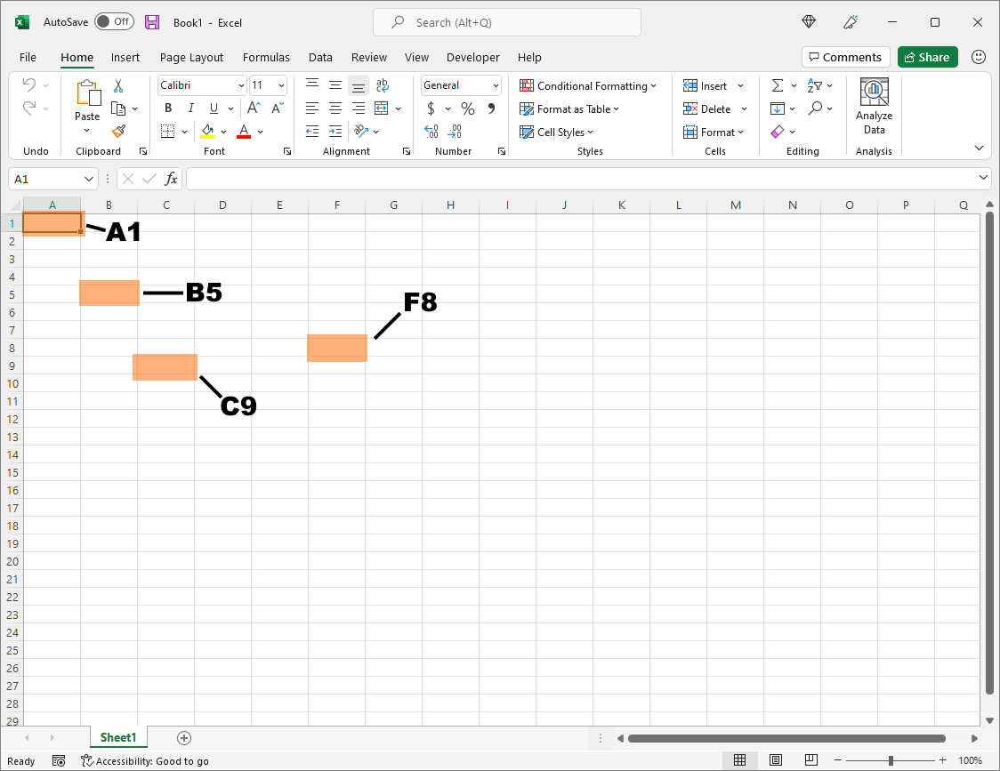
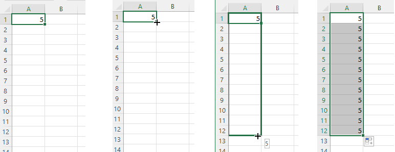
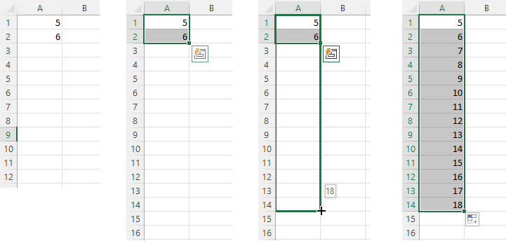
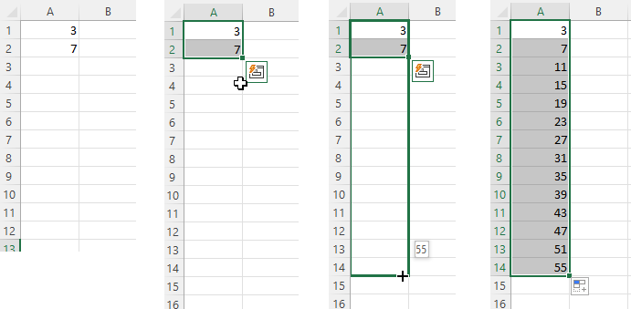
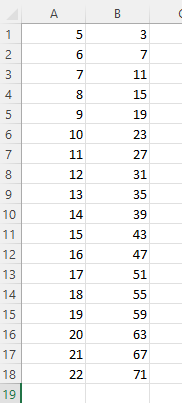
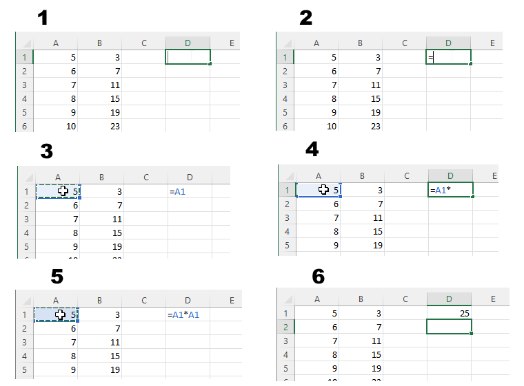
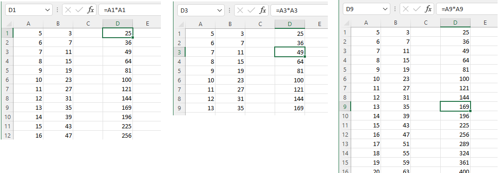
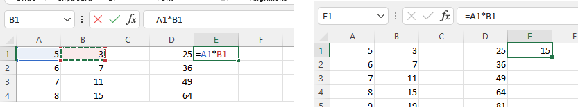
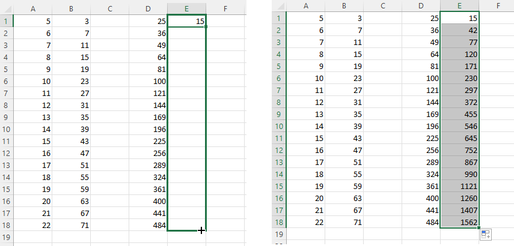
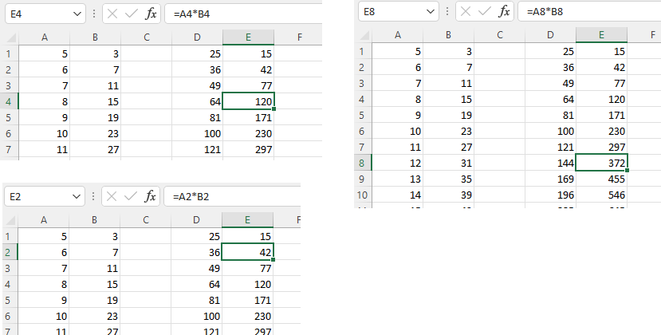

# Santykinės, absoliučiosios ir mišriosios langelių koordinatės

<iframe width="560" height="315" src="https://www.youtube.com/embed/O_HK1eafsvs" title="YouTube video player" frameborder="0" allow="accelerometer; autoplay; clipboard-write; encrypted-media; gyroscope; picture-in-picture" allowfullscreen></iframe>

Microsoft Excel aplinkoje kiekvienas langelis turi savo koordinates. Pavyzdžiui: `A1`; `B5`; `C9`; `F8` ir pan.

Šioje koordinačių sistemoje galima kurti skaičių sekas. Jeigu tarkim užrašome skaičių 5, jo langelį pažymim ir pratempiam žemyn - gausime skaičių seką, sudarytą iš to skaičiaus, t.y. jis bus atkartotas nurodytą kiekį kartų.

Taip pat, galima kurti ir kitokias skaičių sekas. Tokiu atveju reikėtų į du ar daugiau langelių įrašyti norimos sekos pradžią, pavyzdžiui, 5 ir 6, tuomet pažymėti šiuos du langelius ir pratempti.

Skaičių sekas galima kurti ir iš kitokių žingsnių. Tam vėlgi reikia nurodyti pirmus bent du skaičių sekos skaičius, juos pažymėti ir pratempti.

## Santykinės langelių koordinatės

<iframe width="560" height="315" src="https://www.youtube.com/embed/wBDBZ2-nKlQ" title="YouTube video player" frameborder="0" allow="accelerometer; autoplay; clipboard-write; encrypted-media; gyroscope; picture-in-picture" allowfullscreen></iframe>

Dėl santykinių langelių koordinačių pavyzdžių naudosime žemiau matomas skaičių sekas:

Iš pradžių pasiruošime skaičiavimą (formulę), ką bandysime koordinačių sistemoje pritaikyti santykiniu būdu.

Bus atliekami tokie veiksmai:

1. Du kartus paspaudžiame ant pirmos eilutės langelio, pavyzdžiui, ant `D1`.
2. Rašome lygybę (`=`).
3. Su pele vieną kartą paspaudžiame ant `A1` langelio.
4. Paspaudžiame žvaigždutės simbolį (`*`) / parašome daugybos ženklą.
5. Dar kartą su pele vieną kartą paspaudžiame ant `A1` langelio.
6. Spaudžiame `enter` mygtuką. Matome rezultatus.

Kaip ir skaičių sekos generavimo atveju - pratempiame šios formulės rezultatus pro sekančius langelius.

Formulės pritaikymo rezultatai bus pritaikyti santykinai, t.y. kiekvienoje eilutėje formulė bus perskaičiuota slenkant langelius, kurių skaičiai yra dauginami.

Pavyzdžiui, langelyje `D1`, buvo dauginta `A1` iš `A1`, todėl `D2` langelyje buvo dauginta `A2` iš `A2`, `D3` langelyje - `A3` iš `A3` ir t. t.

Tokiu pačiu principu galima pamėginti pritaikyti ir kitą formulę. Langelyje `E1` pamėginkime sudauginti `A1` su `B1`.

Bei šį langelį pratempti pro visą stulpelį.

Rezultatuose vėlgi galima pastebėti, kad kiekvieno langelio formulė buvo pritaikyta imant santykinai kitų langelių reikšmes.

**Visų šių rezultatų koordinatės yra santykinės.** Rezultatus pratempus ir didėjant eilutės numeriui, visada didėja ir formulėse naudojamų stulpelių eilutės numeriai. Tas pats vyksta ir tempiant horizontaliai.

## Mišriosios langelių koordinatės

<iframe width="560" height="315" src="https://www.youtube.com/embed/WqdFf3_wQ5M" title="YouTube video player" frameborder="0" allow="accelerometer; autoplay; clipboard-write; encrypted-media; gyroscope; picture-in-picture" allowfullscreen></iframe>

<!-- Mišriosios koordinatės yra tuomet, kai vieną (arba stulpelį, arba eilutę) mes padarome absoliučiomis. Tai padaryti galima su dolerio ženklu (`$`) arba spaudžiant `F4` mygtuką. -->

## Absoliučiosios langelių koordinatės

<iframe width="560" height="315" src="https://www.youtube.com/embed/YL23XS6D2ys" title="YouTube video player" frameborder="0" allow="accelerometer; autoplay; clipboard-write; encrypted-media; gyroscope; picture-in-picture" allowfullscreen></iframe>
