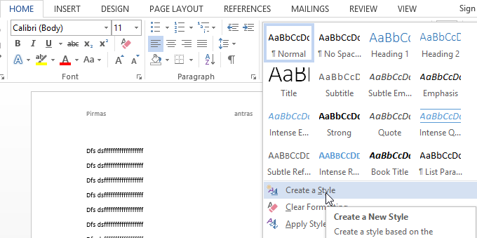
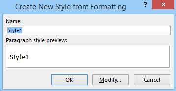
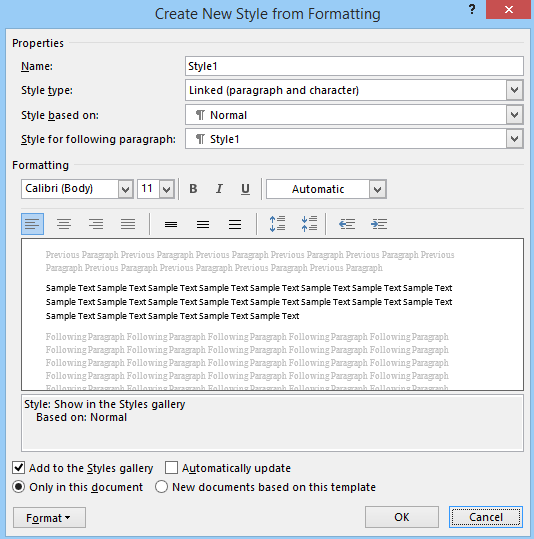

# Antraščių ir pastraipų stilius

Antraščių ir pastraipų stilius galima kurti iš pagrindinės įrankių juostos, išskleidus "stiliai" ir pasirinkus "kurti naują stilių".

Tuomet reikia pasirinkti stiliaus pavadinimą ir spausti "tvarkyti" ar "keisti".

Atsidariusioje lentelėje uždėti visus norimus stilius ir spausti "gerai".

