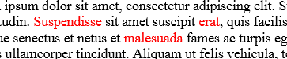
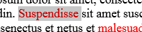
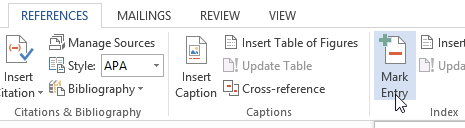
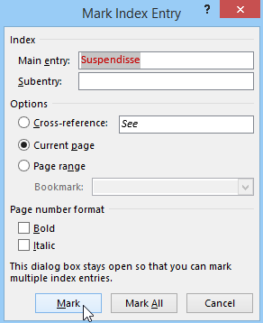
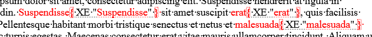
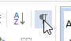
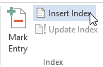

# Dalykinės rodyklės

Žodžių nebūtina niekaip išskirti, tačiau, kad būtų lengviau pamatysi ir suprasti rezultataus, aš nuspalvinau tris žodžius raudonai. Juos reikia suindeksuoti, kad būtų galima išvesti visą dalykinę rodyklę.

Pažymėjus vieną iš norimų žodžių reikia eiti į "nuorodos" – "pažymėti įrašą".

Atsidariusioje lentelėje reikia spausti "žymėti". Pažymėjus žodį, lentelę galima uždaryti.

Taip reikia sužymėti visus norimus žodžius.

Pažymėjus žodžius gali pradėti trukdyti tai kas parodo kur padėti kokie tarpai ir pan., tai galima išjungti iš pagrindinės įrankių juostos.

Norint įterpti dalykę rodyklę (visų pažymėtų žodžių sąrašą), reikia eiti ten pat kur spaudėte norint pažymėti žodžius, tačiau pasirinkti nebe žymėjimo funkciją, o indekso (dalykinės rodyklės) funkciją. Atsidariusioje lentelėje spausti "gerai".

Dalykinė rodyklė bus išvesta vietoje, kurioje tuo metu buvo žymeklis.

