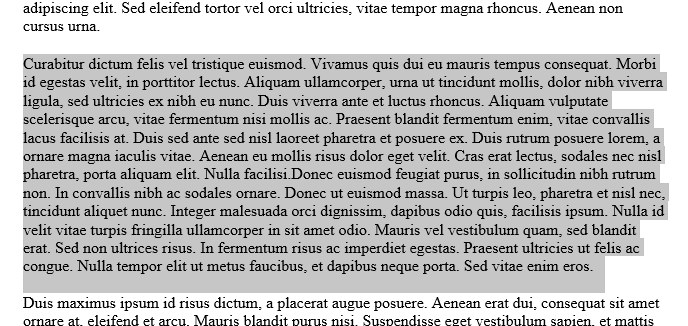
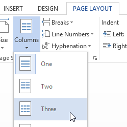
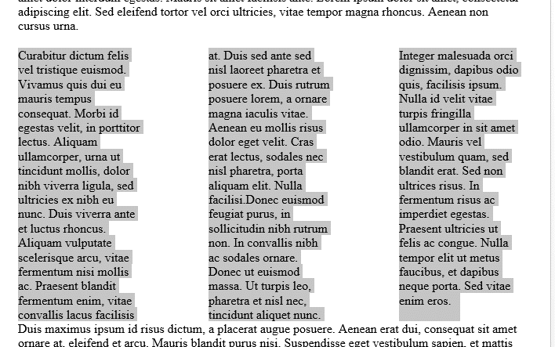
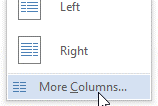
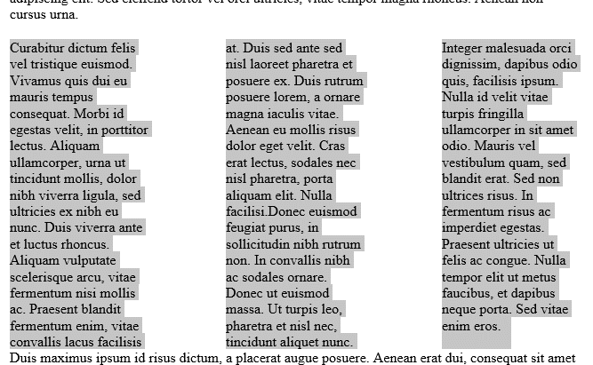
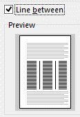
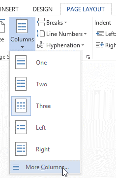
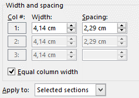

# Dokumento išskaidymas

## Teksto išskaidymas į atskiras skiltis (stulpelius)

Tekstą išskaidyti į stulpelius (skiltis) galima dviem būdais:

- Pasirašius tekstą, pažymėjus norimą dalį ir išskaidžius
- Pritaikyti išskaidymo formuluotės pradžią, rašyti tekstą, daryti stulpelių lūžius ir užbaigti skaidymą į stulpelius.

### Prieš tai pasirašius tekstą

Tekste reikia pažymėti pastraipą, kurią norima išskaidyti į atskiras skiltis.

Tuomet tereikia nueiti į "puslapio išdėstymas" įrankių juostą, joje "stulpeliai".

Tekstas bus suformatuotas pagal pasirinktą stulpelių skaičių.

Taip pat, galima naudoti ir daugiau skilčių nei galima rinktis iš šablonų. Tam užtenka paspausti "daugiau stulpelių".

## Skiltys atskirtos vertikaliu brūkšniu

Norint pridėti vertikalų brūkšnį reikia pažymėti naujai sudarytas skiltis.

Tuomet eiti į puslapio išdėstymo įrankių juostą, joje pasirinkti "stulpeliai" ir "daugiau stulpelių".

Pažymėjus "vertikali linija" gausime norimą rezultatą.

## Tarpai tarp skilčių ir jų plotai

Norint pakeisti naujai sudarytų skilčių pločius ir tarpus tarp jų, reikia jas pažymėti.

Tuomet eiti į puslapio išdėstymo įrankių juostą, joje pasirinkti "stulpeliai" ir "daugiau stulpelių".

Atsidariusioje lentelėje galima keisti pločius ir tarpus. Galima tuos pačius skaičius naudoti bendrai visiems stulpeliams, arba galima kiekvieną keisti individualiai.

