# Kelių lygių sąrašai

## Kaip kurti kelių lygių sąrašus

Pats paprasčiausias būdas būtų tiesiog pasirinkti tokį sąrašą iš pagrindinės įrankių juostos.

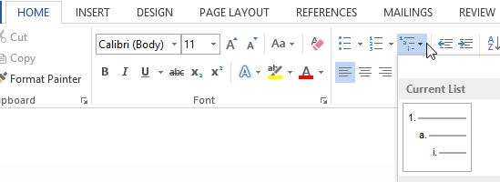

Tuomet parašyti tiek pirmo lygio sąrašo elementų kiek reikia.

Kai reikia patraukti nuo krašto (sukurti antro lygio sąrašo elementų), paprasčiausias būdas būtų tiesiog paspausti `TAB` mygtuką, esantį klaviatūros kairėje pusėje. Taip bus galima rašyti esant antrame sąrašo lygmenyje.

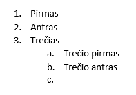

Kai reikia grįžti į aukštesnį lygį užtenka paspausti `ENTER`, arba `SHIFT` + `TAB`.

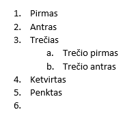

Šias kombinacijas galima naudoti ir viską parašius viename lygmenyje, užtenka žymeklį padėti prieš patį pirmą sąrašo elemento simbolį.

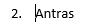

Ir tuomet panaudoti `TAB` norint sukurti gilesnį lygmenį arba `SHIFT` + `TAB` arba `ENTER` norint sukurti aukštesnį lygmenį. Šiuos veiksmus taip pat galima atlikti su šiais mygtukais, esančiais prie sąrašų kūrimo mygtukų.

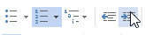

Norint baigti sąrašą galima spaudinėt `ENTER` tiek kartų kol dingsta visa numeracija.

## Numeravimo stilius ir ženklinimas skirtinguose lygmenyse

Numeravimo stilių galima pakeisti tiesiog pasirenkant esamą stilių.

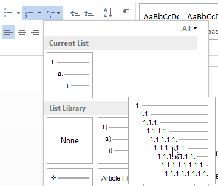

Tačiau, jeigu nėra reikiamo ženklinimo stiliaus, viską galima padaryti rankiniu būdu arba sukurti naują stilių. Pirmuoju atveju reikia paspausti ant norimo pakeisti ženklinimo lygmens kurio nors elemento, kad jie taptų pažymėti.

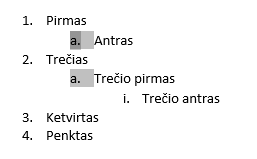

Tuomet galima pasirinkti norimą stilių iš vieno lygio sąrašų stilių.

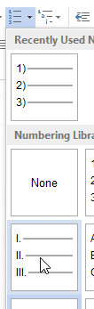

Sąraše, tame lygmenyje esančių elementų ženklinimo stilius pasikeist į pasirinktą stilių.

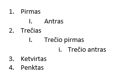

Norint susikurti nuosavą stilių prie sąrašų stilių reikia spausti, kad sukurti naują stilių. Galima kurti stilių iškart kelių lygmenų sąrašams, arba vieno.

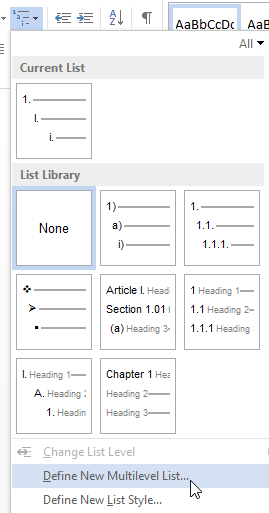

Šioje lentelėje galima pasirinkti stilius kiekvienam lygmeniui atskirai:

- Ženklinimą.
- Šriftus.
- Teksto lygiavimą.
- Atitraukimus.

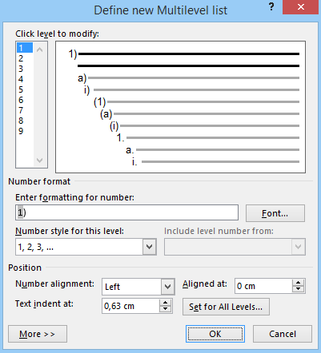
