# Lentelės

## Lentelių kūrimas

Lentelės kuriamos nuėjus į "įterpimas" įrankių juostą, joje "lentelė" ir pažymint plotą, kuris atspindėtų mūsų norimos lentelės langelių skaičių.

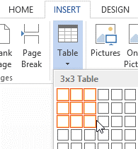

Jeigu vėliau prireikia daugiau eilučių arba stulpelių, toje vietoje užvedus pelę atsiras galimybė papildyti lentelę nauju stulpeliu ar eilute.

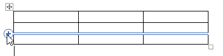

## Langelių suliejimas

Norint sulieti langelius, juos reikia pažymėti.

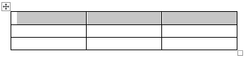

Tuomet prie visų "Word" įrankių juostos atsiras dvi lentelių nustatymų juostos: dizainas, išdėstymas. Išdėstymo įrankių juostoje reikia pasirinkti langelių suliejimą.

## Langelių aukštis ir plotis

Galima pažymėti vieną ar daugiau langelių, kurių aukštį ir/ar plotį norima keisti.

Tuomet lentelės išdėstymo įrankių juostoje galima keisti aukščio ir pločio reikšmes.

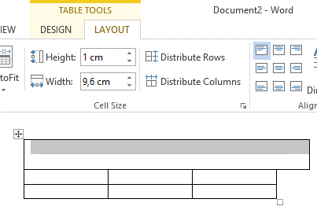

## Langelių paraštės

Pažymėjus reikiamą langelį ar lentelę, paraštes galima redaguoti iš lentelių išdėstymo įrankių juostos, pasirinkus langelio paraštės nustatymus.

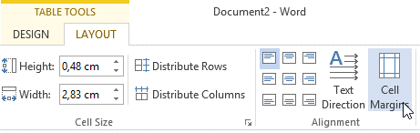

Galima rinktis kokios paraštės bus langelių viršuje, apačioje, kairėje ir dešinėje.

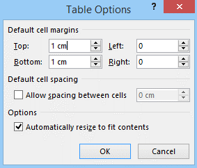

Jeigu norite, pažymėjus visą lentelę galima pamatyti ar paraštės užsidėjo gerai (tamsesne spalva teksto plotas).

## Teksto lygiavimas langeliuose

Tekstą galima lygiuoti visoje lentelėje vienodai (tokiu atveju reikia pažymėti visą lentelę), arba galima skirtinguose langeliuose pritaikyti skirtingą teksto lygiavimą (tokiu atveju reiktų pažymėti atskirus langelius).

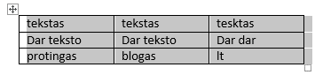

Tuomet eiti į lentelės išdėstymo įrankių juostą, joje pasirinkti norimą lygiavimą.

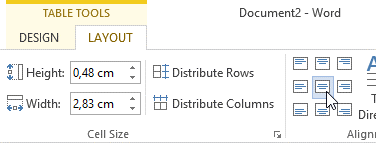

## Rikiavimas pagal stulpeliuose esančią informaciją

Reikia pažymėti rikiuojamus langelius, bei langelius priklausomus nuo rikiuojamų langelių. Pavyzdžiui, šioje lentelėje rikiavimas bus atliekamas pagal pirmąjį stulpelį, tačiau antrojo stulpelio reikšmės turi laikytis greta pirmųjų, todėl abu šie stulpeliai yra pažymėti.

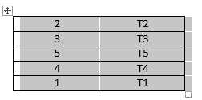

Tuomet lentelės išdėstymo įrankių juostoje spauskite ant "rikiavimas".

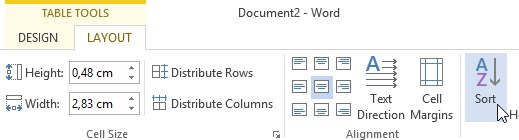

Tuomet pasirenkamas stulpelis pagal kurį turi būti atliktas rikiavimas. Jeigu pirmąjame stulpelyje reikšmės sutaptų, tada rikiavimą galima atlikti ir pagal antrąjį stulpelį.

## Rėmelių formatavimas

Rėmelių formatavimui galima žymėti visą lentelę, arba norimus langelius. Visos pažymėto ploto išorinės linijos  skaitysis kaip rėmelio kraštai.

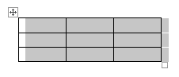
 
Rėmelių formatavimo nustatymus galima rasti prie lentelės dizaino įrankių juostos, skiltyje "rėmeliai". Iš čia galima keisti linijų storį, spalvą ir kitus formatavimo dalykus, šiuos rėmelius pritaikyti pasirinktam plotui, arba su rėmelio piešimo įrankiu galima "nupiešti" norimus rėmelius, norimose vietose.

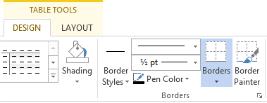
