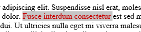
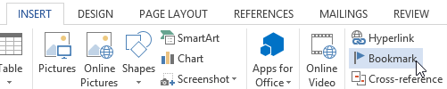
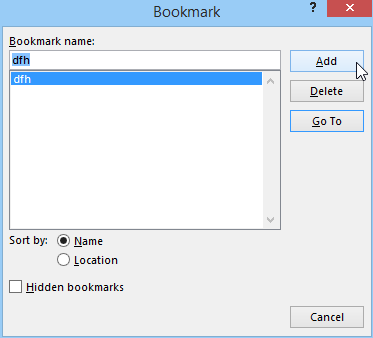
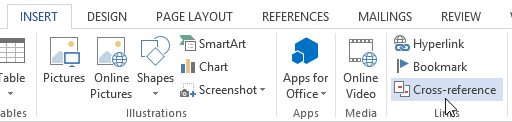
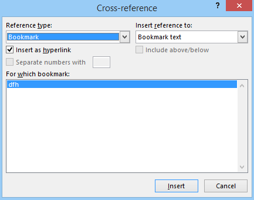
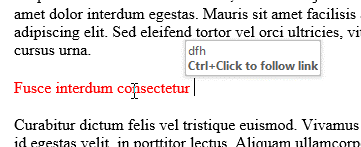
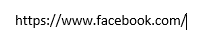
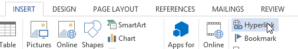
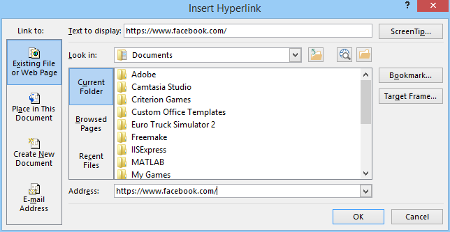

# Nuorodos

## Į kažkurią kitą dokumento vietą

Iš pradžių reikia pažymėti vietą į kurią norima padaryti nukreipimą.

Tuomet "įterpti" – "žyma".

Pasirodžiusioje lentelėje reikia įrašyti kokį nors pavadinimą ir jį pridėti.

Tuomet galima įterpti nuorodą į šią vietą. Nueikite į tą dokumentavo vietą kurioje nori sukurti nuorodą į šią pažymėtą dokumento vietą. Tuomet "įterpti" – "kryžminė nuoroda".

Atsidariusioje lentelėje reikia susirasti naujai sukurtą žymą.

Ant šių žodžių galima spausti laikant `CTRL` mygtuką, taip iškart būsite nugabentas į pažymėtą dokumento vietą.

## Į internetinį tinklalapį

### Lengviausias būdas

Lengviausias būdas įdėti nuorodą į kokį nors internetinį puslapį yra tiesiog nusikopijuoti nuorodą iš naršyklės lango.

Įklijuoti "Word" dokumente (`CTRL + V`).

Paspausti `ENTER`, kad pereiti į naują eilutę, arba `SPACE`, kad padaryti tarpą. Tai užskaitys įdėtą nuorodą kaip nuorodą.

### Kitas būdas

"Įterpti" – "hipersaitas".

Vietoje "adresas" reikia įrašyti internetinio tinklaraščio nuorodą (su `http://`).

