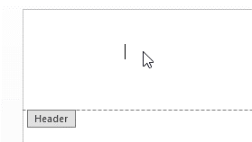
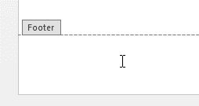
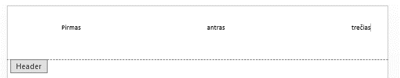

# Puslapinės antraštės ir poraštės

Norint redaguoti antraštes arba poraštes reikia du kartus paspausti puslapio viršuje arba apačioje, arti krašto. Iškart atsiras header ir footer zonos, kuriose galit įdėti papildomą informaciją, kuri atsikartos visuose dokumento puslapiuose (nebent tai pakeisite).

Keisti įvairius nustatymus, pridėti reikalingą numeraciją ar visą kitą galima iš antraščių ir poraščių dizaino įrankių juostos.

Norimą tekstą galima iškart parašyti ir jį suformatuoti pasinaudojant pagrindinių įrankų juosta. Jei reikia peršokti į kitą stulpelį, reikia paspausti `TAB`.

