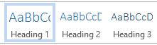
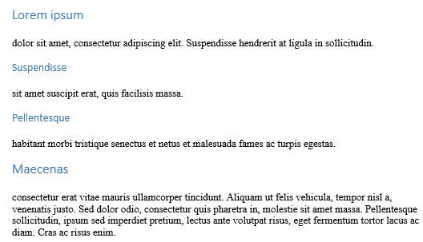
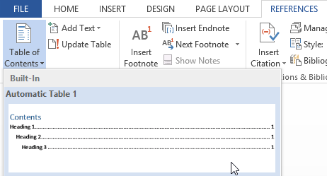
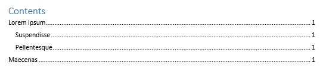

# Puslapio turinys

Puslapio turinys sudaromas iš antraščių, todėl skirtingoms puslapio dalims naudokite ne "antraštes" (kitaip suformatuotą tekstą), o tikras antraštes.

Puslapio turinys įterpiamas iš "nuorodos" įrankių juostos ir "turinys".

