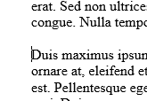
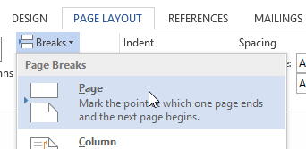

# Puslapių lūžiai

Norint tekstą arba bet kokį dokumento elementą perkelti į naują puslapį nespaudinėjant daug kartų `ENTER`, reikia žymeklį padėti ten kur norimas toks skėlimas.

Tuomet užtenka nueiti į "puslapio išdėstymas" įrankių juostą. Iš ten "lūžiai". Ir pasirinkti "puslapio".

