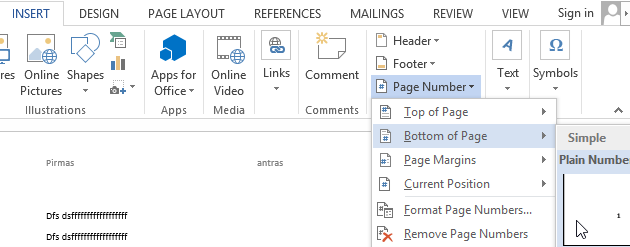

# Puslapių numeravimas

Puslapių numeraciją galima įdėti redaguojant antraštes arba poraštes ir pasinaudojant įrankiais esančiais antraščių ir poraščių dizaino įrankių juostoje.

Arba kitas būdas: eiti į "įterpti" – "puslapių numeravimas" ir pasirenkant norimą numeravimą.

