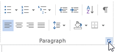
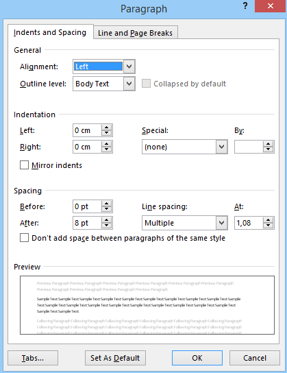
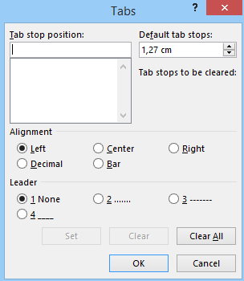

# Tabuliavimo žymės

Norint keisti tabuliavimo žymių nustatymus, pagrindinėje įrankių juostoje, prie "paragrafai" reikia spausti rodyklę, kuri atidarys išplėstus nustatymus.

Atsidariusioje lentelėje galima keisti įvairius paragrafų nustatymus. Arba eitį į "tabuliavimas".

Šioje lentelėje galima keisti tabuliavimo nustatymus, pavyzdžiui, kokį plotį užima vienas `TAB`.

