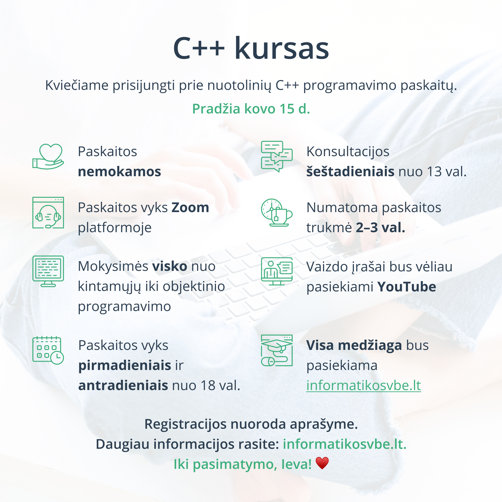

# Paskaitos (2020-2021 m. m.)

Paskaitos vyks nuotoliniu būdu, naudojant [Zoom](https://zoom.us/) platformą, taip pat, tiesioginę transliaciją žiūrėti bei rasti galutinius įrašus bus galima [mūsų Youtube kanale](https://www.youtube.com/channel/UCP3MANaEkoW4LXa74e1xzgQ). Dalyvauti gali visi norintis, paskaitos nemokamos.

<iframe width="560" height="315" src="https://www.youtube.com/embed/QEj41Spf0AE" frameborder="0" allow="accelerometer; autoplay; clipboard-write; encrypted-media; gyroscope; picture-in-picture" allowfullscreen></iframe>

## Pagrindinė informacija

- Paskaitos vyktų per **zoom**. Būtų daromi įrašai, kurie būtų vėliau pasiekiami per **youtube**. Todėl pačiose paskaitose būtų gerai, kad dalyvautų nebijantys kameros ir atsidūrimo youtubėj, tačiau bus galimybė dalyvauti ir nesijungiant kameros ir/ar mikrofono. Zoom bus naudojamas paskaitos vedimui realiu laiku, kad būtų galima visus neaiškumus išspręsti vietoje, o youtube bus naudojamas palikti paskaitų įrašus dėl ateities kartų ar norintiems pasikartoti tą pačią medžiagą.
- **Visa medžiaga bus pasiekiama šiame internetiniame tinklalapyje**. Ši medžiaga ateityje bus prieinama ir `*.pdf` formatu.
- **Paskaitos nemokamos**.
- Paskaitos vyktų pasirinktu laiku nuo **kovo kažkurios savaitės iki šių metų egzamino**. **Laiką susitartume** su tais, kurie pasiryžtų lankyti paskaitas realiu laiku (per zoom). Tikriausiai paskaitos vyktų kažkuriais vakarais darbo dienomis arba savaitgaliais.
- **Numatoma paskaitos trukmė 2-3 val.**. Paskaitos trukmė pagrinde priklausys nuo pačių besimokančiųjų, kurie gali pavargti greičiau arba kaip tik dar būti pajėgūs mokytis ilgiau.
- **Būtų visos temos nuo pat pradžių** (per ką rašyti kodą, kintamieji, ...) **iki objektinio programavimo**. Pirmas dėmesys bus skiriamas sintaksės išmokimui, o tada po lengva bus pereinama prie loginių uždavinių. Šis kursas turėtų tikti ir jaunesniems nei 12-okai, bei tiems, kurie labai sunkiai gaudosi tai ką dabar mokosi, bei tiems kurie nori iki kauliukų išnarplioti visas subtilybes ir pan.
- **Spėjant - būtų duodama daugiau** ir įdomiau nei reikalauja mokyklų programa, kad parodyti kas dar galima ir t. t.

## Preliminarus paskaitų tvarkaraštis

Paskaitų tvarkaraštis sudaromas norintiems mokytis ar pagilinti žinias tik programavime C++.

| Data | Paskaita (temos) | Būsena |
|-|-|-|
| ... | Pradžia; aplinkos pasiruošimas; kodo tvarkingumas; kintamieji; informacijos išvedimas į konsolę | Suplanuota |
| ... | Aritmetiniai veiksmai; informacijos nuskaitymas iš konsolės | Suplanuota |
| ... | Patikrinimo sąlyga if | Suplanuota |
| ... | Loginiai patikrinimo operatoriai; patikrinimo sąlyga switch | Suplanuota |
| ... | Ciklai; ciklas for | Suplanuota |
| ... | Ciklas while; ciklas do while | Suplanuota |
| ... | Masyvai; vienmatis masyvas | Suplanuota |
| ... | Dvimatis masyvas | Suplanuota |
| ... | Darbas su duomenų failais | Suplanuota |
| ... | Funkcijos | Suplanuota |
| ... | Funkcijos | Suplanuota |
| ... | Objektinis programavimas | Suplanuota |
| ... | Objektinis programavimas | Suplanuota |
| ... | Objektinis programavimas | Suplanuota |
| ... | Jūsų pasiūlytos programos | Suplanuota |
| ... | Ankstesnių metų egzaminų užduotys | Suplanuota |
| ... | Ankstesnių metų egzaminų užduotys | Suplanuota |
| ... | Ankstesnių metų egzaminų užduotys | Suplanuota |
| ... | ... | ... |
| ... | ... | ... |

## Registracija

Norintys dalyvauti turėtų užpildyti žemiau matomą formą:

 

Jeigu forma neveikia, galite spausti [šią nuorodą](https://form.typeform.com/to/n75WldR5).
