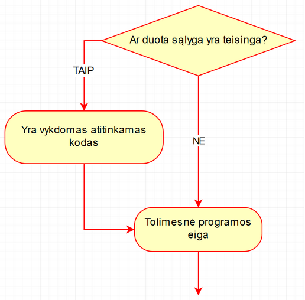

# Patikrinimo sąlyga if: if dalis

## Vaizdo pamoka

Informacija ruošiama.

## Apie `if` dalį

Rašoma norint patikrinti ar palyginti vieną dalyką ir įvykdyti kodą, jei patikrinimas grąžins `true` tipo atsakymą.

## `if` dalies veikimas



## `if` sintaksė

```cpp
if (sąlyga)
{
    /* kodas, jei sąlyga yra teisinga (atsakymas į
    klausimą yra true) */
}
```

## Pavyzdžiai

### Pavyzdys 1

Kodas:

```cpp
#include <iostream>
using namespace std;

int main()
{
	if (5 > 3)
	{
		cout << "5 yra daugiau uz 3" << endl;
	}

	if (-7 > -10)
	{
		cout << "-7 yra daugiau uz -10" << endl;
	}
}
```

Rezultatai:

```
5 yra daugiau uz 3
-7 yra daugiau uz -10

```

### Pavyzdys 2

Kodas:

```cpp
#include <iostream>
using namespace std;

int main()
{
	if (3 < 5)
	{
		cout << "3 yra maziau uz 5" << endl;
	}

	if (8 < 0)
	{
		cout << "8 yra maziau uz 0" << endl;
	}
}
```

Rezultatai:

```
3 yra maziau uz 5

```

### Pavyzdys 3

Kodas:

```cpp
#include <iostream>
using namespace std;

int main()
{
	int skaicius = 5;

	if (skaicius > 0)
	{
		cout << "skaicius yra teigiamas" << endl;
	}

	if (skaicius < 0)
	{
		cout << "skaicius yra neigiamas" << endl;
	}
}
```

Rezultatai:

```
skaicius yra teigiamas

```

### Pavyzdys 4

Kodas:

```cpp
#include <iostream>
using namespace std;

int main()
{
	int skaicius = 4;

	if (skaicius > 0)
	{
		cout << "skaicius yra teigiamas" << endl;
	}

	if (skaicius == 0)
	{
		cout << "skaicius yra lygus 0" << endl;
	}
}
```

Rezultatai:

```
skaicius yra teigiamas

```

### Pavyzdys 5

Kodas:

```cpp
#include <iostream>
using namespace std;

int main()
{
	int skaicius = 5;

	if (skaicius > 5)
	{
		cout << skaicius << " > 5" << endl;
	}

	if (skaicius >= 5)
	{
		cout << skaicius << " >= 5" << endl;
	}

	if (skaicius == 5)
	{
		cout << skaicius << " == 5" << endl;
	}
}
```

Rezultatai:

```
5 >= 5
5 == 5

```

### Pavyzdys 6

Kodas:

```cpp
#include <iostream>
#include <string>
using namespace std;

int main()
{
	string zodis = "suo";

	if (zodis == "Suo")
	{
		cout << "Suo";
	}

	if (zodis == "suo")
	{
		cout << "suo";
	}

	if (zodis == "SUO")
	{
		cout << "SUO";
	}
}
```

Rezultatai:

```
suo
```

### Pavyzdys 7

Kodas:

```cpp
#include <iostream>
#include <string>
using namespace std;

int main()
{
	string vardas = "Paulius";
	int amzius = 20;

	if (amzius >= 18)
	{
		cout << vardas << " yra pilnametis";
	}
}
```

Rezultatai:

```
Paulius yra pilnametis
```

### Pavyzdys 8

Kodas:

```cpp
#include <iostream>
using namespace std;

int main()
{
	if (5 + 3 >= 6)
	{
		cout << "salyga 5 + 3 >= 6 yra teisinga" << endl;
	}

	if (8 * 2 < 20)
	{
		cout << "salyga 8 * 2 < 20 yra teisinga" << endl;
	}
}
```

Rezultatai:

```
salyga 5 + 3 >= 6 yra teisinga
salyga 8 * 2 < 20 yra teisinga

```

### Pavyzdys 9

Kodas:

```cpp
#include <iostream>
using namespace std;

int main()
{
	int pirmas = -5;
	int antras = 4;

	if (pirmas + 7 > 0)
	{
		cout << "prie " << pirmas << " pridejus 7, jis yra teigiamas" << endl;
	}

	if (antras * 2 > 10)
	{
		cout << "skaiciu " << antras
            << " padauginus is 2, jis yra didesnis nei 10" << endl;
	}
}
```

Rezultatai:

```
prie -5 pridejus 7, jis yra teigiamas

```

### Pavyzdys 10

Kodas:

```cpp
#include <iostream>
using namespace std;

int main()
{
	int skaicius = 4;

	if (skaicius % 2 == 0)
	{
		cout << "skaicius " << skaicius << " dalinasi is 2" << endl;
	}

	if (skaicius % 3 == 0)
	{
		cout << "skaicius " << skaicius << " dalinasi is 3" << endl;
	}

	if (skaicius % 4 == 0)
	{
		cout << "skaicius " << skaicius << " dalinasi is 4" << endl;
	}
}
```

Rezultatai:

```
skaicius 4 dalinasi is 2
skaicius 4 dalinasi is 4

```

### Pavyzdys 11

Kodas:

```cpp
#include <iostream>
using namespace std;

int main()
{
	int skaicius = 8;

	if (skaicius % 2 != 0)
	{
		cout << "skaicius " << skaicius << " nedalinasi is 2" << endl;
	}

	if (skaicius % 3 != 0)
	{
		cout << "skaicius " << skaicius << " nedalinasi is 3" << endl;
	}

	if (skaicius % 4 != 0)
	{
		cout << "skaicius " << skaicius << " nedalinasi is 4" << endl;
	}
}
```

Rezultatai:

```
skaicius 8 nedalinasi is 3

```

### Pavyzdys 12

Kodas:

```cpp
#include <iostream>
using namespace std;

int main()
{
	bool mokausi_programuoti = true;

	if (mokausi_programuoti == true)
	{
		cout << "mokausi programuoti! 1" << endl;
	}

	if (mokausi_programuoti)
	{
		cout << "mokausi programuoti! 2" << endl;
	}
}
```

Rezultatai:

```
mokausi programuoti! 1
mokausi programuoti! 2

```

### Pavyzdys 13

Kodas:

```cpp
#include <iostream>
using namespace std;

int main()
{
	int skaicius;
	cout << "iveskite skaiciu: ";
	cin >> skaicius;

	if (skaicius > 0)
	{
		cout << "ivestas skaicius teigiamas" << endl;
	}

	if (skaicius < 0)
	{
		cout << "ivestas skaicius neigiamas" << endl;
	}
}
```

Rezultatas 1:

```
iveskite skaiciu: 8
ivestas skaicius teigiamas

```

Rezultatas 2:

```
iveskite skaiciu: -7
ivestas skaicius neigiamas

```

### Pavyzdys 14

Kodas:

```cpp
#include <iostream>
#include <string>
using namespace std;

int main()
{
	string marke, modelis;
	int gamybos_metai, dabar_metai;

	cout << "Iveskite marke: ";
	cin >> marke;

	cout << "Iveskite modeli: ";
	cin >> modelis;
	
	cout << "Iveskite gamybos metus: ";
	cin >> gamybos_metai;

	cout << "Iveskite dabartinius metus: ";
	cin >> dabar_metai;

	if (dabar_metai - gamybos_metai < 5)
	{
		cout << "Automobilis " << marke << " "
			<< modelis << " yra naujesnis nei 5 metu." << endl;
	}
}
```

Rezultatas 1:

```
Iveskite marke: ford
Iveskite modeli: focus
Iveskite gamybos metus: 2002
Iveskite dabartinius metus: 2020

```

Rezultatas 2:

```
Iveskite marke: ford
Iveskite modeli: kazkoks
Iveskite gamybos metus: 2018
Iveskite dabartinius metus: 2020
Automobilis ford kazkoks yra naujesnis nei 5 metu.

```

## Užduotys

### Užduotis 1

Liepkite vartotojui įvesti tris skaičius. Parašykite šias atskiras if sąlygas:

- Ar pirmas ir antras skaičiai yra lygūs?
- Ar antras ir trečias skaičiai yra lygūs?
- Ar pirmas skaičius yra didesnis už antrąjį?
- Ar antras skaičius yra didesnis už dvigubą trečiojo skaičiaus reikšmę (trečias skaičius padaugintas iš 2)?
- Ar pirmas skaičius yra lyginis (ar dalinasi iš 2)?
- Ar antras skaičius yra nelyginis (ar nesidalina iš 2)?
- Ar trečias skaičius yra teigiamas (didesnis už 0)?
- Ar pirmas skaičius yra neigiamas (mažesnis už 0)?
- Ar antras skaičius dalinasi iš 4?
- Ar trečias skaičius dalinasi iš 8?

### Užduotis 2

Liepkite vartotojui įvesti amžių. Patikrinkite ar amžius yra didesnis arba lygus 18-ai, jei taip - išveskite "jūs galite balsuoti".

### Užduotis 3

Liepkite vartotojui įvesti kelis pažymius. Raskite šių pažymių vidurkį. Patikrinkite ar vidurkis teigiamas (daugiau arba lygu 5-iems), jei taip - išveskite "vidurkis teigiamas".

### Užduotis 4

Liepkite vartotojui įvesti bet kokį skaičių. Atlikite šiuos patikrinimus ir veiksmus:

- Jei skaičius dalinasi iš 5, tuomet išveskite šio skaičiaus daugybos lentelę nuo 1 iki 5.
- Jei skaičius lyginis, tuomet išveskite šį skaičių, jo kvadratą ir jį padalintą iš 2.
- Jei skaičius nesidalina iš 7, tuomet susikurkite antrąjį kintamąjį, išveskite šių dviejų skaičių sumą, skirtumą, sandaugą, dalmenį.

### Užduotis 5

Liepkite vartotojui įvesti bet kokį teigiamą skaičių. Parašykite šias atskiras if sąlygas:

- patikrinti ar skaičius neigiamas, jei taip - aprėkti vartotoją :)
- patikrinti ar skaičius teigiamas, jei taip - pasveikinti vartotoją;
- patikrinti ar skaičius lyginis;
- patikrinti ar skaičius dalinasi iš 4;
- patikrinti ar skaičius yra didesnis nei 10.

### Užduotis 6

Liepkite įvesti skaičių. Parašykite šias atskiras if sąlygas:

- Jei skaičius lyginis, tuomet išveskite šį skaičių, bei jo penktą laipsnį.
- Jei skaičius nesidalina iš 4, tuomet liepkite įveskite antrąjį skaičių. Išveskite abiejų skaičių sumą ir sandaugą.
